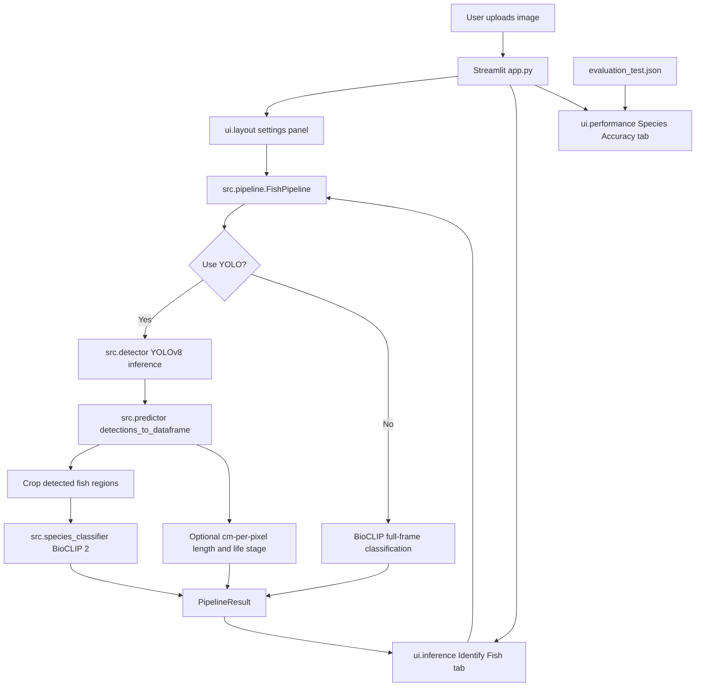

<div align="center">

  

  <h1> FishVision-AI</h1>

  <h3>Marine Fish Detection, Species Classification & Biometric Estimation</h3>

  <p>
    <strong>
      Streamlit UI • YOLOv8 Localization • BioCLIP 2 Species Recognition • OAK-D Pro Depth Workflow
    </strong>
  </p>

  <p>
    <a href="https://www.python.org/">
      
    </a>
    <a href="https://streamlit.io/">
      
    </a>
    <a href="https://pytorch.org/">
      
    </a>
    <a href="https://www.ultralytics.com/">
      
    </a>
    <a href="LICENSE">
      
    </a>
  </p>

</div>
---

## Project Overview

FishVision-AI is a computer-vision project for analyzing fish imagery. The repository contains a Streamlit dashboard, a reusable inference pipeline, a BioCLIP 2 training stack, dataset preparation utilities for OzFish crop metadata, and an optional OAK-D Pro live camera workflow.

The main inference path is intentionally modular:

- **YOLOv8** detects fish bounding boxes when localization is enabled.
- **BioCLIP 2** classifies detected crops, or the full uploaded frame when YOLO is disabled.
- **Biometrics utilities** estimate length and life stage from pixel scale in the web app, and from stereo depth in the OAK-D runner.
- **Evaluation artifacts** power the Species Accuracy tab and document test-set performance without recomputing metrics at app startup.

> [!NOTE]
> This project reports model metrics only from checked-in evaluation artifacts. No README metric is estimated or inferred from source comments.

---

## Key Features

- **Interactive Streamlit dashboard** with image upload, light/dark presentation theme, floating settings, model-status banners, result metrics, annotated image display, and CSV export.
- **Two inference modes**:
  - YOLO + BioCLIP: detect fish first, then classify each crop.
  - BioCLIP-only: classify the entire uploaded image, useful for single-fish or pre-cropped photos.
- **Fine-grained species classifier** built on `hf-hub:imageomics/bioclip-2` through OpenCLIP, with a linear classifier head and optional LoRA adapters.
- **Top-K species predictions** returned per fish detection, with configurable `top_k` in the dashboard.
- **Per-species accuracy browser** backed by `experiments/bioclip2_full_20260716_160143/plots/evaluation_test.json`.
- **Dataset engineering pipeline** for parsing OzFish metadata, validating data quality, computing statistics, selecting viable species, and creating train/val/test splits.
- **Training modes** for BioCLIP 2: LoRA fine-tuning, linear probing, full fine-tuning, smoke test, debug run, checkpoint resume, class weighting, and mixed precision.
- **Optional OAK-D Pro runner** with RGB/depth queues, median depth sampling, geometric length estimation, IoU/distance tracking, CSV logging, frame capture, and non-fish veto filtering.

---

## Demo

Add screenshots or screen recordings here after capturing the current UI:

```text
docs/
  screenshots/
    dashboard-empty.png
    dashboard-results.png
    species-accuracy.png
```

---

## System Architecture



The web application keeps UI code in `ui/` and model orchestration in `src/`. `app.py` wires these together, caches expensive resources with Streamlit, validates model availability, and passes the selected settings into `FishPipeline.run(...)`.

---

## Inference Pipeline

`src.pipeline.FishPipeline` is the central inference entry point used by the Streamlit app and reused by the OAK-D workflow.

### YOLO + BioCLIP Mode

1. The user uploads an image through Streamlit.
2. `FishPipeline.run(image, conf, iou, cm_per_pixel, adult_threshold_cm, use_yolo=True)` loads YOLO once and runs `src.detector.run_inference`.
3. `src.predictor.detections_to_dataframe` converts Ultralytics boxes into a structured table with coordinates, confidence, optional estimated length, and life stage.
4. Each detected fish crop is expanded by a 10% margin and passed into `SpeciesClassifierInference.classify_crop`.
5. BioCLIP outputs softmax probabilities and returns ranked Top-K species predictions.
6. The pipeline returns a `PipelineResult` containing `FishDetection` dataclasses, elapsed YOLO/BioCLIP timings, and the annotated frame.

### BioCLIP-Only Mode

When the dashboard toggle disables YOLO, the pipeline skips localization and classifies the full uploaded frame:

```python
pipeline.run(image, use_yolo=False)
```

This mode returns a single full-frame detection result when BioCLIP is available. It does not produce bounding boxes or multi-fish localization.

---

## Training Pipeline

The BioCLIP training workflow is organized as a reproducible sequence:

```mermaid
flowchart LR
    A["OzFish crops + crop_metadata.csv"] --> B["scripts/prepare_dataset.py"]
    B --> C["metadata, reports, statistics"]
    C --> D["scripts/split_dataset.py"]
    D --> E["datasets/processed train/val/test"]
    E --> F["scripts/train_bioclip.py"]
    F --> G["experiments/.../checkpoints"]
    G --> H["scripts/evaluate_model.py"]
    H --> I["evaluation_test.json + confusion matrix"]
    I --> J["Streamlit Species Accuracy tab"]
```



### Dataset Preparation

`scripts/prepare_dataset.py` performs Phase 2 dataset analysis:

- parses `OzFish/crop_metadata.csv`
- validates label and file metadata through `classification.dataset.data_validator`
- computes image-size statistics
- analyzes species and family distributions
- recommends species thresholds
- writes the master catalog to `datasets/metadata/`

### Dataset Splitting

`scripts/split_dataset.py` reads the recommendation report, selects species by threshold, and builds an ImageFolder-style dataset:

```text
datasets/processed/
  train/<species>/*
  val/<species>/*
  test/<species>/*
```

The default split ratio in configuration is `70% / 15% / 15%`, with seed `42`.

### BioCLIP Training

`scripts/train_bioclip.py` builds:

- OpenCLIP visual backbone: `hf-hub:imageomics/bioclip-2`
- classifier head: `LayerNorm -> Dropout -> Linear`
- optional LoRA adapters with rank `16` and alpha `32`
- weighted sampler for class imbalance
- AdamW optimizer, cosine schedule with warmup, mixed precision, gradient clipping, and early stopping

Supported modes:

```bash
python scripts/train_bioclip.py --smoke-test
python scripts/train_bioclip.py --debug
python scripts/train_bioclip.py --mode lora --epochs 30
python scripts/train_bioclip.py --mode linear_probe
python scripts/train_bioclip.py --mode full_finetune
python scripts/train_bioclip.py --resume experiments/<run>/checkpoints/<checkpoint>
```

---

## Model Performance

The following results come from:

```text
experiments/bioclip2_full_20260716_160143/plots/evaluation_test.json
```

| Metric | Value |
|---|---:|
| Test images | 18,296 |
| Species classes | 157 |
| Top-1 accuracy | 72.64% |
| Top-5 accuracy | 91.72% |
| Macro precision | 0.8443 |
| Macro recall | 0.7504 |
| Macro F1 | 0.7723 |
| Weighted F1 | 0.7479 |
| Inference time | 5.53 ms/image |

The production manifest at `models/bioclip_production/model_manifest.json` records a promoted BioCLIP 2 run with `val_accuracy=0.7379`, `val_top5_accuracy=0.9233`, and `f1_macro=0.7815`.

---

## OAK-D Pro Live Workflow

The optional live workflow lives in `src/oak_runner.py` and `src/oak_detector.py`.

It uses DepthAI v3 to:

- connect to an OAK-D device
- build RGB and stereo-depth streams
- sample median depth from the central 30% of each detection box
- convert pixel spans to real-world millimeters using camera intrinsics
- estimate length, width, weight, and maturity where depth is valid
- maintain persistent track IDs with `FishTracker`
- reject likely false positives using a COCO YOLO veto gate, size filters, and bbox sanity checks
- save CSV rows to `logs/oak_detections.csv`
- save frame captures to `logs/captures/`

Run it from the project root:

```bash
python -m src.oak_runner
```

> [!IMPORTANT]
> The OAK-D workflow requires optional packages that are commented out in `requirements.txt`: `depthai` and `opencv-python`.

---

## Tech Stack

| Area | Technology | Purpose |
|---|---|---|
| Web UI | Streamlit | Dashboard, upload flow, settings, metrics, charts, CSV export |
| Detection | Ultralytics YOLOv8 | Fish bounding-box localization |
| Classification | PyTorch, OpenCLIP, BioCLIP 2 | Species classification on crops or full frames |
| Efficient tuning | PEFT LoRA | Parameter-efficient BioCLIP adaptation |
| Data processing | pandas, Pillow, NumPy | Metadata parsing, image loading, tabular outputs |
| Training | PyTorch DataLoader, AMP | Train/val loops, weighted sampling, mixed precision |
| Evaluation | scikit-learn, matplotlib | Accuracy, precision, recall, F1, confusion matrix |
| Optional edge workflow | DepthAI, OpenCV | OAK-D Pro RGB/depth capture and live visualization |
| Configuration | YAML | Dataset, augmentation, model, logging, and training settings |

---

## Project Structure

```text
fish_detection/
|-- app.py
|-- requirements.txt
|-- LICENSE
|-- assets/
|   |-- animation_1.mp4
|   |-- favicon.svg
|   |-- image.png
|   `-- logo.svg
|-- classification/
|   |-- config/
|   |   |-- augmentation.yaml
|   |   |-- dataset.yaml
|   |   |-- default.yaml
|   |   |-- logging.yaml
|   |   |-- model.yaml
|   |   `-- training.yaml
|   |-- dataloader/
|   |   `-- fish_dataset.py
|   |-- dataset/
|   |   |-- data_splitter.py
|   |   |-- data_validator.py
|   |   |-- ozfish_parser.py
|   |   `-- species_selector.py
|   |-- models/
|   |   |-- backbone.py
|   |   `-- classifier.py
|   |-- preprocessing/
|   |   `-- image_processor.py
|   |-- trainer/
|   |   `-- training_engine.py
|   `-- utilities/
|       |-- device.py
|       |-- seed.py
|       `-- taxonomy.py
|-- datasets/
|   `-- metadata/
|       |-- master_species_catalog.csv
|       `-- master_species_catalog.json
|-- experiments/
|   `-- bioclip2_full_20260716_160143/
|       |-- checkpoints/
|       |-- config/
|       |-- logs/
|       |-- metrics/
|       `-- plots/
|-- models/
|   |-- best.pt
|   `-- bioclip_production/
|       `-- model_manifest.json
|-- scripts/
|   |-- evaluate_model.py
|   |-- prepare_dataset.py
|   |-- split_dataset.py
|   `-- train_bioclip.py
|-- src/
|   |-- biometrics.py
|   |-- detector.py
|   |-- oak_detector.py
|   |-- oak_runner.py
|   |-- pipeline.py
|   |-- predictor.py
|   |-- species_classifier.py
|   |-- tracker.py
|   |-- utils.py
|   `-- veto_gate.py
`-- ui/
    |-- components.py
    |-- css.py
    |-- inference.py
    |-- layout.py
    |-- performance.py
    |-- style.css
    `-- svg.py
```

---

## Module Overview

| Module | Responsibility |
|---|---|
| `app.py` | Streamlit entry point; loads CSS, evaluation JSON, cached pipeline, page tabs, and settings |
| `ui/layout.py` | Header, hero, settings popover, about popover, footer |
| `ui/inference.py` | Upload flow, pipeline call, result metrics, annotated frame, details, CSV export |
| `ui/performance.py` | Test-set accuracy dashboard and per-species table |
| `src/pipeline.py` | Unified YOLO + BioCLIP pipeline and result dataclasses |
| `src/detector.py` | YOLO model loading and image inference |
| `src/predictor.py` | YOLO result parsing and optional cm-per-pixel length/life-stage fields |
| `src/species_classifier.py` | BioCLIP inference wrapper, checkpoint discovery, LoRA/head reconstruction |
| `src/biometrics.py` | Dimension, weight, maturity, and max-length utilities |
| `src/tracker.py` | IoU and center-distance tracking for live video |
| `src/veto_gate.py` | COCO YOLO non-fish overlap veto logic |
| `src/oak_detector.py` | DepthAI v3 camera connection, queue setup, depth geometry |
| `src/oak_runner.py` | OAK-D live loop, logging, capture saving, overlays |
| `classification/models/` | Backbone abstraction and classifier head |
| `classification/dataloader/` | PyTorch datasets, DataLoaders, weighted sampling |
| `classification/trainer/` | Training engine and experiment/checkpoint management |
| `scripts/` | Dataset preparation, splitting, training, and evaluation commands |

---

## Installation

### 1. Clone the repository

```bash
git clone https://github.com/JinjavadiyaVijay/FishVision-AI.git
cd FishVision-AI
```

### 2. Create and activate an environment

Windows PowerShell:

```powershell
python -m venv venv
.\venv\Scripts\Activate.ps1
```

macOS/Linux:

```bash
python -m venv venv
source venv/bin/activate
```

### 3. Install dependencies

```bash
pip install -r requirements.txt
```

For OAK-D Pro live detection, install the optional camera dependencies:

```bash
pip install depthai opencv-python
```

---

## Quick Start

Launch the web dashboard:

```bash
streamlit run app.py
```

Then open the local Streamlit URL, upload an image, and choose the inference mode from the settings popover:

- turn **Use YOLO detection** on for multi-fish localization
- leave it off for BioCLIP full-frame classification
- adjust confidence, IoU, Top-K, and length settings as needed

---

## Configuration

Configuration is split by concern:

| File | Purpose |
|---|---|
| `.streamlit/config.toml` | Streamlit base theme |
| `classification/config/model.yaml` | BioCLIP/OpenCLIP backbone, classifier head, LoRA settings |
| `classification/config/training.yaml` | epochs, batch size, optimizer, scheduler, precision, checkpointing |
| `classification/config/dataset.yaml` | source paths, processed paths, split ratios, validation thresholds |
| `classification/config/augmentation.yaml` | train and validation preprocessing/augmentation |
| `classification/config/logging.yaml` | logging configuration |

The Streamlit dashboard also exposes runtime controls for YOLO confidence, IoU, Top-K species predictions, `cm_per_pixel`, and adult length threshold.

---

## Common Commands

Prepare dataset metadata and reports:

```bash
python scripts/prepare_dataset.py
```

Split the processed dataset:

```bash
python scripts/split_dataset.py
python scripts/split_dataset.py --threshold 300
```

Run a fast training smoke test:

```bash
python scripts/train_bioclip.py --smoke-test
```

Train BioCLIP with LoRA:

```bash
python scripts/train_bioclip.py --mode lora --epochs 30
```

Evaluate the best checkpoint on the test split:

```bash
python scripts/evaluate_model.py
```

Launch OAK-D Pro live detection:

```bash
python -m src.oak_runner
```

---

## Model and Data Requirements

Required for web inference:

- `models/best.pt` for YOLO detection mode
- a BioCLIP checkpoint discoverable from:
  - `models/bioclip_production/best_accuracy.pt`, or
  - an experiment checkpoint under `experiments/*/checkpoints/best_accuracy.pt`

Required for training:

- OzFish crop images under `OzFish/crops-zip/assets/projects/FDFML/crops`
- OzFish metadata at `OzFish/crop_metadata.csv`
- processed splits under `datasets/processed/` after running the dataset scripts

---

## Hardware Notes

| Workflow | Minimum | Recommended |
|---|---|---|
| Streamlit UI | CPU-capable Python environment | CUDA GPU for faster BioCLIP inference |
| BioCLIP LoRA training | CUDA GPU strongly preferred | 6GB+ VRAM, batch size adjusted by mode |
| Full fine-tuning | High-memory GPU | More than 6GB VRAM |
| OAK-D live mode | Luxonis OAK-D device | USB 3 connection and DepthAI v3-compatible environment |

The training configuration is tuned conservatively for Windows with `num_workers=2`, mixed precision, gradient accumulation, and LoRA as the default efficient training path.

---

## Limitations

- BioCLIP production manifest metadata is present in `models/bioclip_production/`, but the inference code ultimately requires an actual `best_accuracy.pt` checkpoint either in that directory or under `experiments/`.
- OAK-D dependencies are optional and commented out in `requirements.txt`; install them only when using the live camera workflow.
- Web-app length estimation from `cm_per_pixel` depends on the scale value supplied by the user.
- Weight and maturity estimates use fixed species-specific coefficients and thresholds in `src/biometrics.py`; they should be treated as project heuristics unless separately validated for a deployment setting.

---

## Roadmap

These are natural extensions based on the current architecture, not implemented features:

- add first-class screenshot assets under `docs/screenshots/`
- publish model cards for YOLO and BioCLIP checkpoints
- add automated tests for pipeline result schemas and dataset split integrity
- package optional OAK-D dependencies as an install extra
- add a checkpoint promotion script that copies both manifest and weights into `models/bioclip_production/`

---

## License

This project is licensed under the MIT License. See [LICENSE](LICENSE).

---

## Acknowledgements

FishVision-AI builds on the open-source Python computer-vision ecosystem, including PyTorch, OpenCLIP, Ultralytics YOLO, Streamlit, scikit-learn, pandas, Pillow, and the BioCLIP model family.
