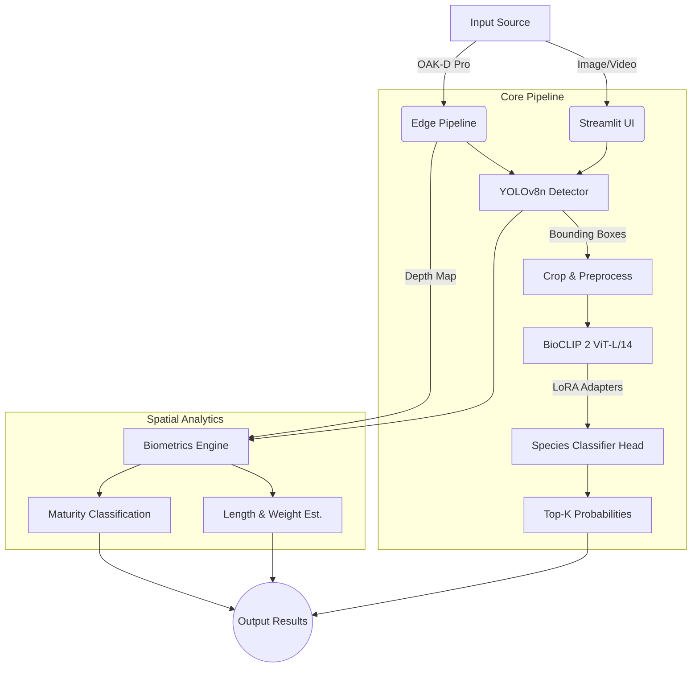

<div align="center">
  
# 🐟 FishVision-AI

**Real-time marine species detection, classification, and biometric estimation at the edge.**

[](https://www.python.org/downloads/release/python-3100/)
[](#)
[](#)
[](#)
[](#)

</div>

## 📖 Project Overview

**FishVision-AI** is an advanced computer vision pipeline designed for marine researchers, conservationists, and aquarists. It combines the rapid localization capabilities of **YOLOv8** with the zero-shot and fine-grained classification power of **BioCLIP 2** to accurately detect and identify **157 marine species** from underwater imagery or live video feeds.

Unlike traditional single-model approaches, FishVision-AI utilizes a cascaded architecture, enabling independent scaling of detection and classification. By integrating with **OAK-D Pro** stereo cameras, the system extends beyond identification to provide real-world biometric estimations (length, weight, and maturity stage) directly at the edge.

---

## ✨ Key Features

- **Cascaded Inference Engine**: Fast YOLOv8n fish localization followed by BioCLIP 2 (ViT-L/14 with LoRA adapters) for highly accurate species classification.
- **Extensive Taxonomy**: Recognizes 157 distinct marine species with a robust fallback to broader categories.
- **Edge-Ready Biometrics**: Deep integration with OAK-D Pro stereo cameras for spatial depth calculation, enabling real-time fish length (cm) and weight (g) estimations.
- **Robust Tracking & Vetoing**: Built-in multi-object tracking (IoU + distance) and a Veto Gate to instantly reject false positives (e.g., humans, divers, equipment).
- **Interactive UI**: A polished, responsive Streamlit dashboard for drag-and-drop image analysis, confidence tuning, and performance visualization.

---

## 🏗️ System Architecture



### 1. Detection Phase (YOLOv8n)
The pipeline ingests raw frames and resizes them to 640×640. YOLOv8n performs highly efficient bounding box regression and objectness scoring. Non-Maximum Suppression (NMS) removes duplicates, filtering detections against a user-defined confidence threshold.

### 2. Classification Phase (BioCLIP 2)
Detected ROIs (Regions of Interest) are cropped with a 10% context margin and resized to 224×224. These crops pass through a frozen BioCLIP 2 Vision Transformer (ViT-L/14) injected with Low-Rank Adaptation (LoRA) weights (rank=16). A custom classification head outputs logits across 157 species.

### 3. Spatial & Biometric Phase (Edge Only)
When utilizing the OAK-D Pro, the pipeline samples the central 30% of the bounding box on the aligned depth map. Using the camera's intrinsics, pixel dimensions are converted to real-world millimeters to estimate fish length, mass, and life stage.

---

## 📊 Model Performance

Evaluated on a strictly isolated test set containing **18,296 images** across **157 species**.

| Metric | Score |
| :--- | :---: |
| **Top-1 Accuracy** | `72.64%` |
| **Top-5 Accuracy** | `91.72%` |
| **Precision (Macro)** | `0.8443` |
| **Recall (Macro)** | `0.7504` |
| **F1 Macro** | `0.7723` |
| **Inference Speed (RTX 3050)**| `5.5 ms / frame` |

*For a detailed, per-species breakdown, launch the Streamlit UI and navigate to the **Species Accuracy** tab.*

---

## 📂 Project Structure

```text
fish_detection/
├── app.py                  # Streamlit UI orchestrator
├── src/                    # Core inference backend
│   ├── pipeline.py         # Unified inference pipeline (YOLO + BioCLIP)
│   ├── detector.py         # YOLO bounding box generation
│   ├── species_classifier.py # BioCLIP 2 LoRA inference
│   ├── oak_runner.py       # OAK-D Pro live edge deployment
│   ├── biometrics.py       # Spatial length/weight calculations
│   ├── tracker.py          # Frame-to-frame multi-object tracking
│   └── veto_gate.py        # False-positive rejection logic
├── ui/                     # Frontend presentation layer
│   ├── components.py       # Reusable Streamlit widgets
│   ├── layout.py           # Page structure & sidebars
│   ├── inference.py        # Detection visualization
│   └── style.css           # Premium application styling
└── scripts/                # R&D and MLOps utilities
    ├── train_bioclip.py    # LoRA fine-tuning script
    ├── evaluate_model.py   # Accuracy metric generation
    └── prepare_dataset.py  # Data cleaning & augmentation
```

---

## 🚀 Quick Start

### Prerequisites
- Python 3.10+
- (Optional) CUDA-compatible GPU for accelerated inference.
- (Optional) Luxonis OAK-D Pro camera for live spatial tracking.

### Installation

1. **Clone the repository:**
   ```bash
   git clone https://github.com/yourusername/FishVision-AI.git
   cd FishVision-AI
   ```

2. **Set up a virtual environment:**
   ```bash
   python -m venv venv
   source venv/bin/activate  # On Windows: venv\Scripts\activate
   ```

3. **Install dependencies:**
   ```bash
   pip install -r requirements.txt
   ```

### Running the Web Dashboard

To perform inference on static images via the browser interface:

```bash
streamlit run app.py
```
*The dashboard will automatically open at `http://localhost:8501`.*

### Running Live Edge Detection

To run real-time inference using an attached Luxonis OAK-D camera:

```bash
python -m src.oak_runner
```
*Press `Q` or `Esc` to quit. Output telemetry and frame captures will be logged to the `logs/` directory.*

---

## ⚙️ Configuration

Both the Web UI and the Edge Runner allow dynamic configuration of the inference pipeline:
- **YOLO Confidence Threshold**: Minimum objectness score (default: `0.10` for challenging underwater environments).
- **IoU Threshold (NMS)**: Non-max suppression overlap limit (default: `0.45`).
- **BioCLIP Mode**: Toggle YOLO off to classify the entire frame directly (ideal for pre-cropped single-fish photos).
- **Top-K Species**: Adjust the number of prediction candidates returned by the classifier.

---

## 📄 License

Distributed under the MIT License. See `LICENSE` for more information.
